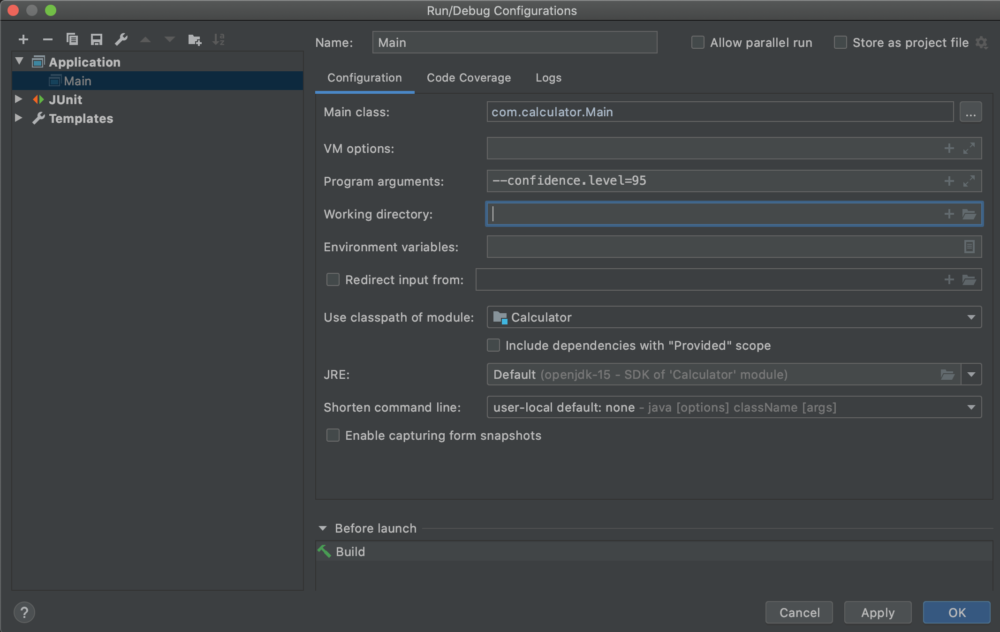
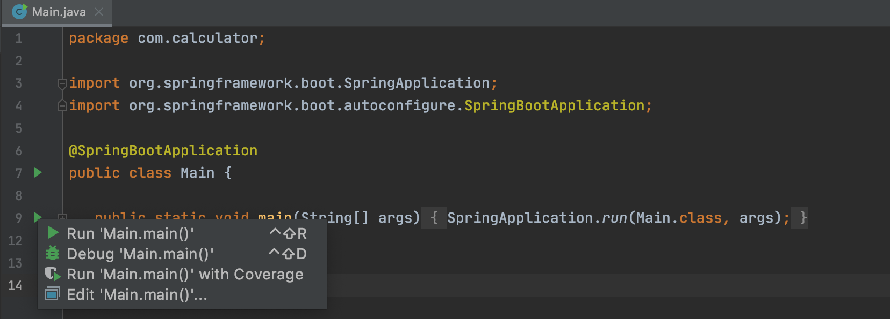

# Value at Risk Calculator
A Spring Boot application to calculate value at risk (VAR) using historical method for a single trade or portfolio.

## Technologies
* Java 11
* Spring Boot
* Maven

## How to run the application
To run this project
1. Clone repository 
2. Run **_mvn clean install_**, to pull all the dependencies from the maven repository.
3. Configure the confidence level in the program arguments eg.

4. Press run on the main class.

## Using the application 
To calculate VAR, there are 2 APIs provided. 
* GET ("/var/singleTrade"): is to calculate VAR for a single trade.
    * Input: A list of historical data with double values.
    * Output: Returns the var in double value.
* GET("/var/portfolio"): is to calculate VAR for a portfolio (multiple trades).
    * Input: A list of all historical data for each trade with double values.
    * Output: Returns the var in double value.

